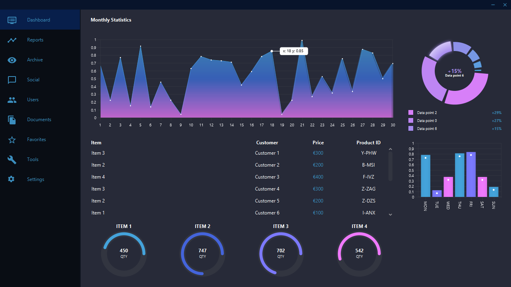

# Desktop dashboard application

Built a basic desktop dashboard application while learning [JavaFX](https://en.wikipedia.org/wiki/JavaFX). The displayed data is randomly generated. The goal was to create a bunch of GUI elements.


## Screenshots


## Folder structure
```
└───Dashboard
    ├───.idea
    │   ├───artifacts
    │   └───Icons
    ├───DashboardPreview
    ├───out
    │   ├───artifacts
    │   │   ├───Dashboard
    │   │   │   └───CustomDashboard
    │   │   └───Dashboard_jar
    │   └───production
    │       └───Dashboard
    │           ├───CustomDashboard
    │           └───META-INF
    └───src
        ├───CustomDashboard
        └───META-INF
  ```


##### April 25, 2019.
